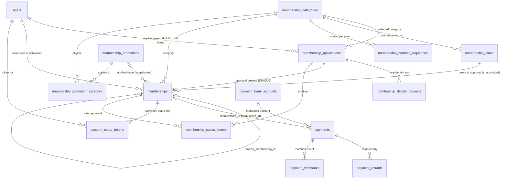
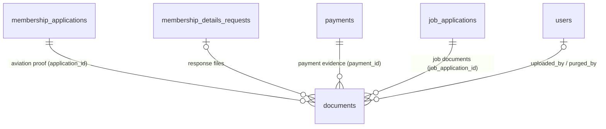
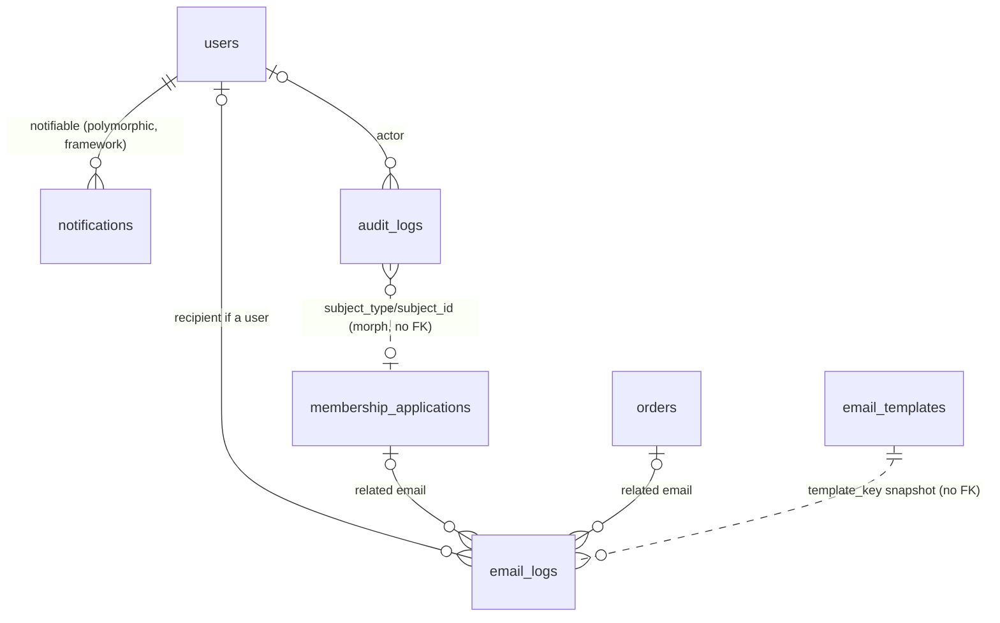
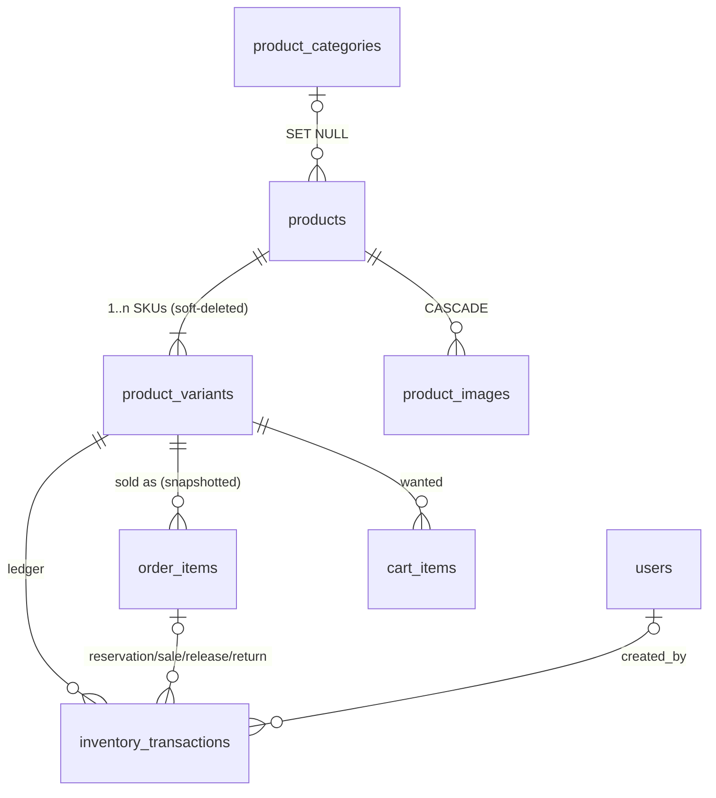
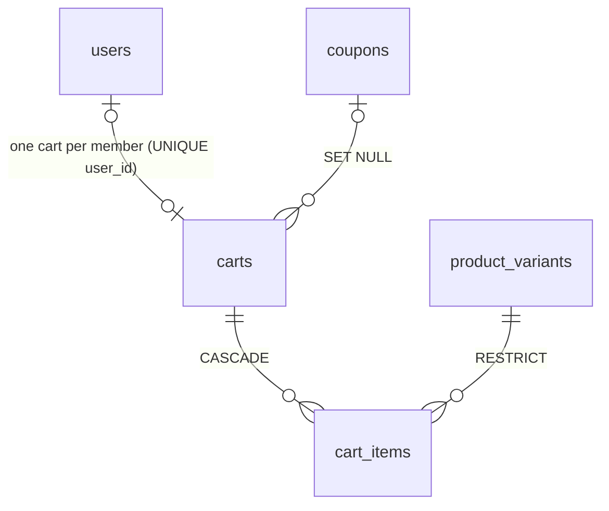
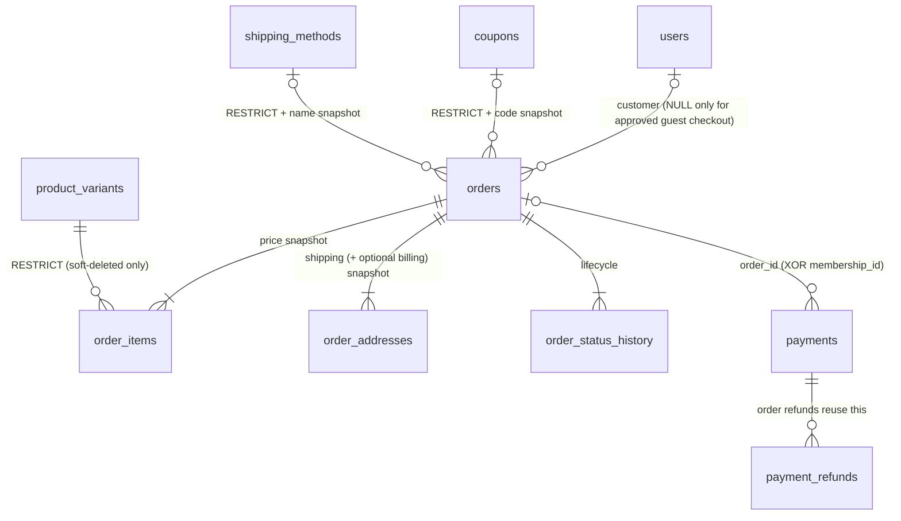
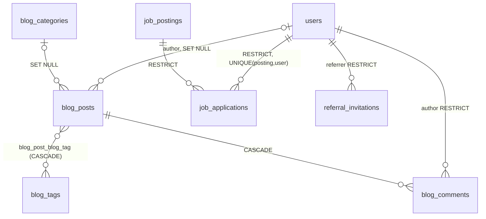

# 13 — Relationship Map

Design only. Mermaid notation: `||` exactly one · `o|` zero or one · `o{` zero or many · `|{` one or many. Every FK is `ON UPDATE RESTRICT`; delete behaviour is stated in the tables under each diagram (`RESTRICT` unless noted).

## 1. Identity → Membership Application → Membership → Promotion → Payment

| Parent → Child | Cardinality | FK column | ON DELETE | Note |
|---|---|---|---|---|
| `users` → `membership_applications` | 0..1 : many | `user_id` | RESTRICT | NULL for a pre-account applicant |
| `membership_categories` → `membership_applications` | 1 : many | `membership_category_id` | RESTRICT | |
| `membership_applications` → `memberships` | 1 : 0..1 | `membership_application_id` (UNIQUE) | RESTRICT | application may exist without a membership; never the reverse |
| `users` → `memberships` | 0..1 : many | `user_id` | RESTRICT | one user, many terms over time |
| `membership_plans` → `memberships` | 1 : many | `membership_plan_id` | RESTRICT | fee/duration also **snapshotted** on the row |
| `membership_promotions` → `memberships` | 0..1 : many | `membership_promotion_id` | RESTRICT | name/free months also snapshotted; **only one** promotion per membership by construction |
| `memberships` → `memberships` | 0..1 : 0..1 | `renews_membership_id` | RESTRICT | renewal lineage |
| `memberships` → `payments` | 0..1 : many | `payments.membership_id` | RESTRICT | free membership ⇒ zero payments |
| `orders` → `payments` | 0..1 : many | `payments.order_id` | RESTRICT | **XOR** with `membership_id` (CHECK) |
| `payments` → `payment_refunds` | 1 : many | `payment_id` | RESTRICT | |
| `payments` → `payment_webhooks` | 0..1 : many | `payment_id` | RESTRICT | idempotency key is `(gateway,event_id)`, not this FK |
| `membership_promotions` ↔ `membership_categories` | many : many | pivot | promotion side CASCADE, category side RESTRICT | |
| `memberships` → `account_setup_tokens` | 1 : many | `membership_id` | RESTRICT | at most one *live* token per (user, purpose) |
| `membership_applications` → `membership_status_history` | 1 : many | `membership_application_id` | RESTRICT | append-only |

**Reading the chain:** an *application* is created and reviewed; on approval a *membership* row is created in `pending_activation` with a snapshot of the plan terms; a *payment* is created only when no promotion applies; activation (free path immediately, paid path after admin confirmation) atomically issues the number (`membership_number_sequences`), sets dates, and records the promotion snapshot; the user and setup token are provisioned; history and audit rows are written.

## 2. Identity → Documents

| Owner → `documents` | Cardinality | FK | ON DELETE | Rule |
|---|---|---|---|---|
| `membership_applications` | 1 : many (≥1 required to submit — app rule) | `membership_application_id` | RESTRICT | `kind = aviation_proof` |
| `membership_details_requests` | 0..1 : many | `membership_details_request_id` | RESTRICT | must belong to the same application (app rule) |
| `payments` | 1 : many | `payment_id` | RESTRICT | `kind = payment_evidence`; resubmission adds rows |
| `job_applications` | 1 : many | `job_application_id` | RESTRICT | `kind = job_application_document`; rules TBC |
| `users` | 0..1 : many | `uploaded_by_user_id`, `purged_by_user_id` | RESTRICT | NULL uploader = anonymous applicant |

**Exactly one owner FK is non-NULL** (CHECK, tied to `kind`). This is an *exclusive arc*, not polymorphism: every owner is a real FK.

## 3. Identity → Notifications and Audit Logs

| Relationship | Kind | Delete | Note |
|---|---|---|---|
| `users` → `notifications` | polymorphic (`notifiable_type='user'`, `notifiable_id`) | n/a (no FK) | Laravel contract; only `user` alias allowed |
| `users` → `email_logs` | typed, nullable | RESTRICT | recipients may be non-users |
| `membership_applications` / `orders` → `email_logs` | typed, nullable | RESTRICT | dominant operational lookups |
| `email_templates` → `email_logs` | **no FK**, `template_key` snapshot | — | log survives template changes |
| `users` → `audit_logs` | typed, nullable | RESTRICT | actor; NULL = system/guest |
| any entity → `audit_logs` | polymorphic (`subject_type/subject_id`) | n/a | the approved exception |

## 4. Products → Variants → Inventory

Stock reading: `product_variants.quantity_on_hand` / `quantity_reserved` are **projections** of `SUM(on_hand_delta)` / `SUM(reserved_delta)` over `inventory_transactions`, updated in the same transaction as each ledger insert, guarded by CHECKs (`>= 0`, `reserved <= on_hand`).

## 5. Cart → Cart Items

Carts hold intent only — **no prices**. Everything financial is re-derived at checkout.

## 6. Order → Order Items → Payment

| Parent → Child | Cardinality | FK | ON DELETE |
|---|---|---|---|
| `orders` → `order_items` | 1 : 1..many | `order_id` | RESTRICT |
| `orders` → `order_addresses` | 1 : 1..2 (`UNIQUE(order_id,type)`) | `order_id` | RESTRICT |
| `orders` → `order_status_history` | 1 : many | `order_id` | RESTRICT |
| `orders` → `payments` | 1 : 0..many (normally 1) | `payments.order_id` | RESTRICT |
| `order_items` → `inventory_transactions` | 1 : 0..many (once-only per reservation/sale/release) | `order_item_id` | RESTRICT |

## 7. Content, jobs and community (brief)

## 8. Delete-behaviour policy at a glance

| Class of relationship | ON DELETE | Examples |
|---|---|---|
| Historical / financial / legal / lifecycle | **RESTRICT** | applications, memberships, payments, refunds, webhooks, documents, history, audit, orders, order items, ledger, job applications, users |
| Pure child/link rows | CASCADE | pivot rows, `cart_items`, `product_images`, `blog_comments` |
| Optional attribution/taxonomy | SET NULL | `blog_posts.author_id`, `created_by_user_id`, `products.product_category_id`, `carts.coupon_id` |

No CASCADE exists on any path that leads to a membership, payment, order, document, history or audit row. A cascading chain that could reach historical data does not exist (verified in `15` §6 circularity/orphan review).
